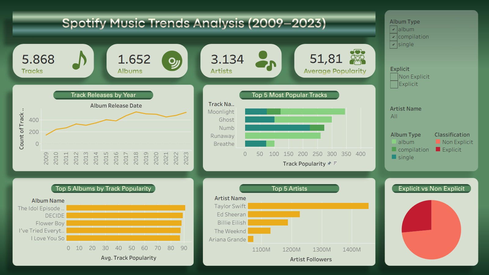
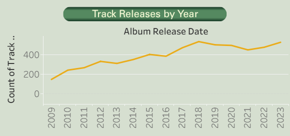
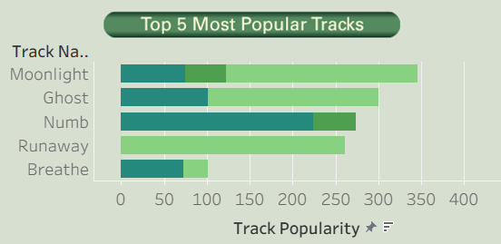
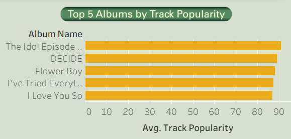
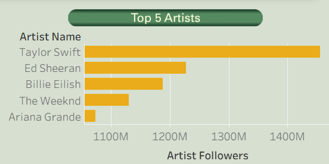
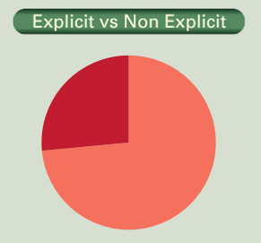

# Spotify Music Trends Analysis (2009–2023)

An interactive Tableau dashboard analyzing Spotify music trends from **2009 to 2023**. This project explores track releases, artist popularity, album performance, and explicit content distribution to uncover insights into the evolution of music on Spotify.

---

## Project Overview

This project aims to analyze Spotify music data using **Tableau** to identify trends in music releases, artist popularity, and album performance between **2009 and 2023**.

The dashboard provides an interactive overview of key metrics and visualizations that help users understand the characteristics of Spotify tracks during the selected period.

---

## Objectives

- Analyze music release trends over time.
- Identify the most popular tracks and albums.
- Discover artists with the largest follower base.
- Compare Explicit and Non-Explicit tracks.
- Build an interactive dashboard for data exploration.

---

## Tools & Technologies

- Tableau
- Data Visualization
- Data Cleaning
- Dashboard Design

---

## Dataset

The dataset contains Spotify track information, including:

- Album Name
- Album Release Date
- Album Type
- Artist Name
- Artist Followers
- Artist Popularity
- Track Name
- Track Popularity
- Explicit Status

Only tracks released between **2009 and 2023** were included in this analysis.

---

## Dashboard Preview



---

# Dashboard Metrics

| KPI | Value |
|------|-------:|
| Total Tracks | **5,868** |
| Total Albums | **1,652** |
| Total Artists | **3,134** |
| Average Track Popularity | **51.81** |

---

# Dashboard Visualizations

## 1. Track Releases by Year



Tracks released on Spotify generally increased between **2009 and 2023**, reaching the highest number of releases in **2018** with **533 tracks**.

**Insight**

- Music production steadily increased over the analyzed period.
- 2018 recorded the highest number of releases.
- A slight decline occurred after 2020 before increasing again in 2023.

---

## 2. Top 5 Most Popular Tracks



This visualization highlights the tracks with the highest popularity scores.

Top tracks include:

- Moonlight
- Ghost
- Numb
- Runaway
- Breathe

**Insight**

Popularity is not evenly distributed across tracks, indicating that a small number of songs dominate listener engagement.

---

## 3. Top 5 Albums by Average Track Popularity



This chart ranks albums based on the average popularity of their tracks.

Highest ranked album:

**The Idol Episode 8**
Average Track Popularity: **91**

**Insight**

Albums with consistently popular tracks outperform albums that rely on only one or two hit songs.

---

## 4. Top 5 Artists by Followers



Taylor Swift has the largest follower base among artists in the dataset.

Top artists include:

- Taylor Swift
- Ed Sheeran
- Billie Eilish
- The Weeknd
- Ariana Grande

**Insight**

Taylor Swift significantly outperforms other artists in terms of Spotify followers, indicating a very strong global fan base.

---

## 5. Explicit vs Non-Explicit



Track distribution:

| Classification | Tracks |
|---------------|-------:|
| Explicit | 4,314 |
| Non Explicit | 1,554 |

**Insight**

Approximately **74%** of the tracks in the dataset are labeled as Explicit, indicating that explicit content dominates the analyzed music catalog.

---

# Key Insights

- A total of **5,868 tracks** from **3,134 artists** and **1,652 albums** were analyzed.
- The average track popularity is **51.81**, indicating moderate popularity across the dataset.
- Music releases generally increased from **2009 to 2023**, peaking in **2018**.
- **Taylor Swift** has the highest number of Spotify followers in the dataset.
- **The Idol Episode 8** achieved the highest average track popularity.
- Explicit tracks account for approximately **74%** of all analyzed tracks.

---

# Repository Structure

```
spotify-music-trends-analysis/
│
├── README.md
│
├── dashboard/
│   ├── Spotify_Music_Trends_Analysis.twbx
│
├── dataset/
│   ├── spotify_dataset.xlsx
│   └── data_dictionary.md
│
└── images/
    ├── spotify_dashboard.png
    ├── track_release.png
    ├── top_tracks.png
    ├── top_albums.png
    ├── top_artists.png
    └── explicit_vs_nonexplicit.png
```

---

# Skills Demonstrated

- Data Cleaning
- Data Visualization
- Dashboard Development
- KPI Design
- Interactive Dashboard
- Trend Analysis
- Ranking Analysis
- Comparative Analysis
- Data Storytelling

---

# Author

**Hanna Zahra Nadia**

- LinkedIn: https://linkedin.com/in/hannazan
- GitHub: https://github.com/hannazan
